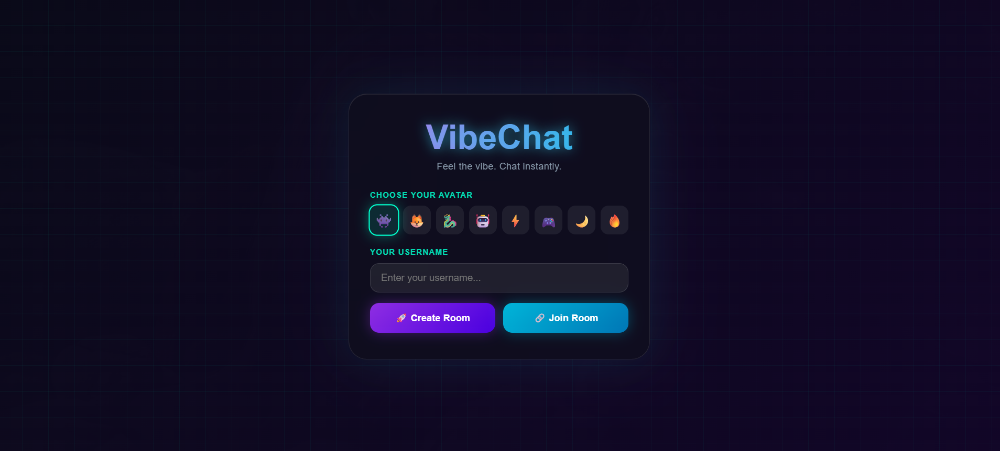
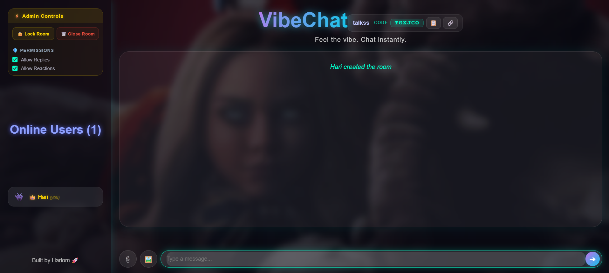
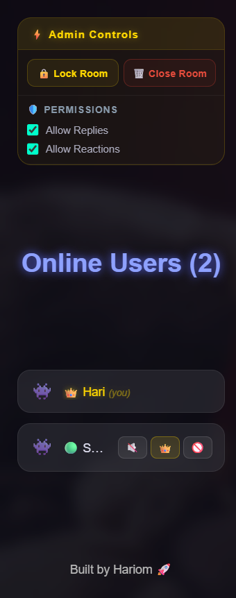
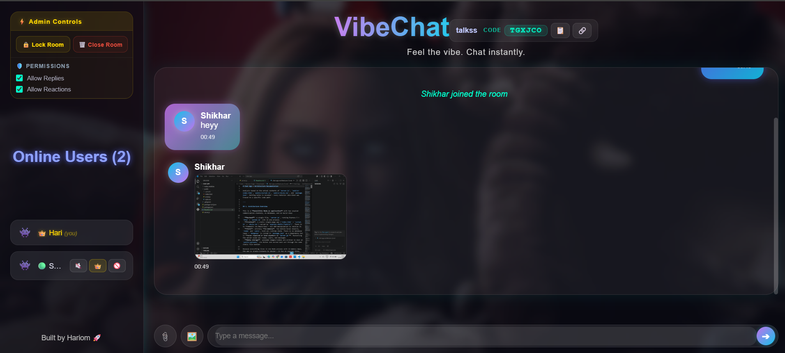

<div align="center">

# 💬 VibeChat

### Real-time room-based chat with secure media sharing and moderation

Create chat rooms, collaborate instantly, securely share media, and manage participants through powerful room administration built with **Node.js**, **Express**, and **Socket.IO**.

<p>
  <a href="https://vibechat-f52d.onrender.com/"><strong>🌐 Live Demo</strong></a>
  •
  <a href="https://github.com/hariomCodes31/VibeChat"><strong>📂 Source Code</strong></a>
</p>


</div>

---

## 📖 Overview

VibeChat is a browser-based real-time chat platform that enables users to create or join chat rooms, communicate instantly, securely share media, and manage participants through an integrated moderation system.

Built with **Node.js**, **Express**, and **Socket.IO**, the application supports room-based communication with features such as room creation, join approval, room locking, media uploads, message reactions, typing indicators, and administrator controls. Media files are validated before storage, while all real-time communication is synchronized through WebSockets.

---

## ✨ Key Features

| Feature | Description |
|----------|-------------|
| ⚡ Real-Time Messaging | Instant communication powered by Socket.IO |
| 🏠 Room Management | Create and join chat rooms using unique room codes |
| 🔒 Room Moderation | Lock rooms and approve participant requests |
| 👑 Admin Controls | Kick, mute, unmute users, and transfer admin ownership |
| 🖼️ Media Sharing | Secure image and video uploads |
| 😊 Message Reactions | React to messages in real time |
| ⌨️ Typing Indicators | Live typing notifications |
| 🔄 Session Recovery | Rejoin rooms after temporary disconnection |
| 🔐 Secure Uploads | File extension, MIME type, and magic-byte validation |
| 📱 Responsive UI | Optimized for desktop and mobile browsers |

---

## 📸 Screenshots

| Home | Chat |
|------|------|
|  |  |

| Admin Controls | Media Sharing |
|----------------|---------------|
|  |  |

---

## 🏗️ Architecture

VibeChat follows a **monolithic Node.js architecture** where a single Express server manages room state, moderation, media handling, and real-time communication.

The frontend communicates with the backend through:

- **Socket.IO** for real-time messaging and room events.
- **HTTP (Express)** for secure media uploads.

For detailed architecture diagrams and technical documentation, see:

📄 **[Architecture Documentation](docs/ARCHITECTURE.md)**

---

## 🛠️ Tech Stack

| Category | Technology |
|----------|------------|
| Frontend | HTML5, CSS3, JavaScript |
| Backend | Node.js, Express.js |
| Real-Time Communication | Socket.IO |
| File Uploads | Multer |
| Storage | Local File System |
| Version Control | Git & GitHub |

---

## 🚀 Getting Started

### Clone the repository

```bash
git clone https://github.com/hariomCodes31/VibeChat.git
```

### Navigate to the project

```bash
cd VibeChat
```

### Install dependencies

```bash
npm install
```

### Start the server

```bash
npm start
```

or

```bash
node server.js
```

Open your browser and visit:

```text
http://localhost:3000
```

---

## 📚 Documentation

Additional technical documentation is available:

- 📄 [System Architecture](docs/ARCHITECTURE.md)

---

## 🚀 Future Improvements

- User authentication
- Database persistence
- Private messaging
- Voice messages
- Video calling
- Push notifications
- End-to-end encryption
- Progressive Web App (PWA)

---

## 👨‍💻 Author

**Hariom Singh**

If you found this project useful, consider giving it a ⭐ on GitHub.

---