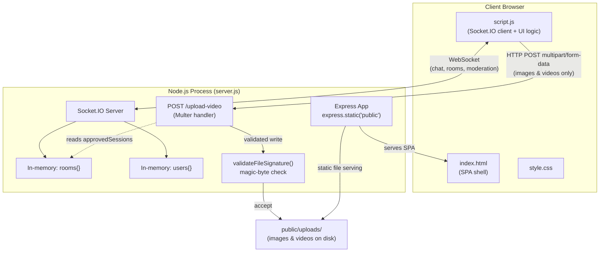
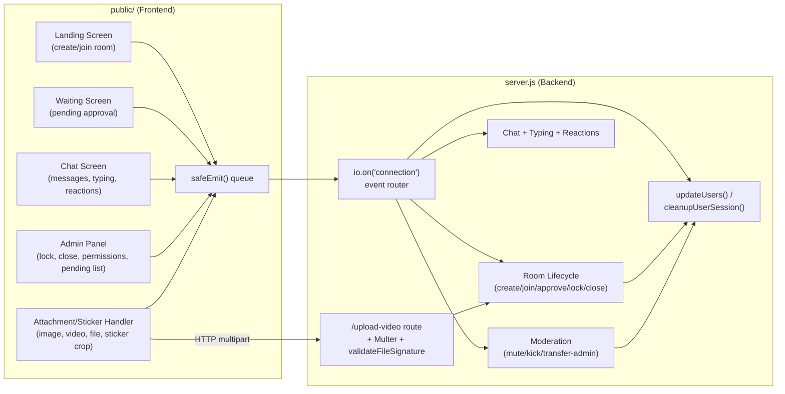
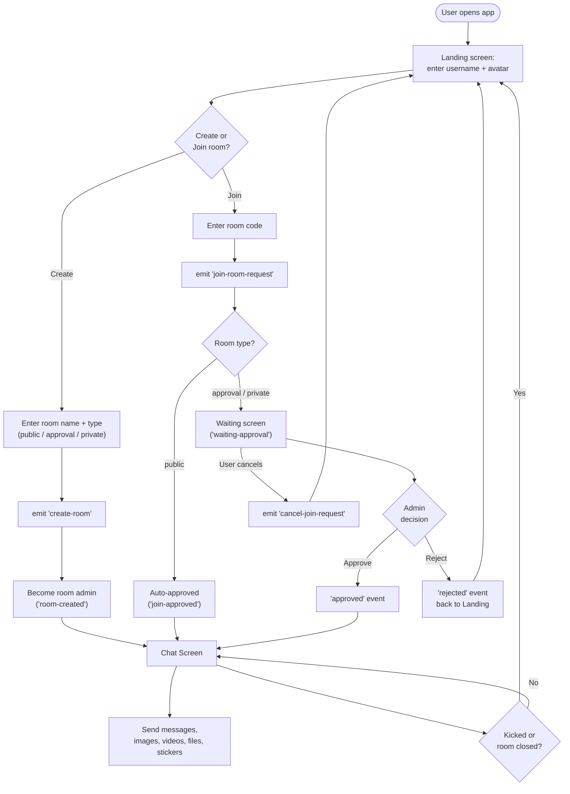
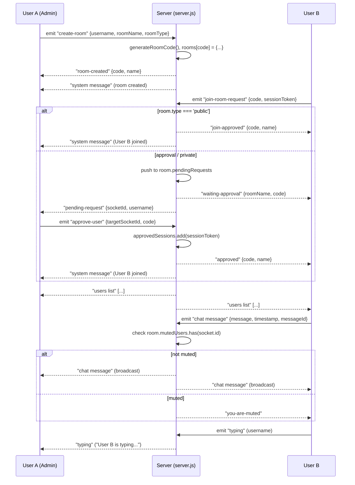
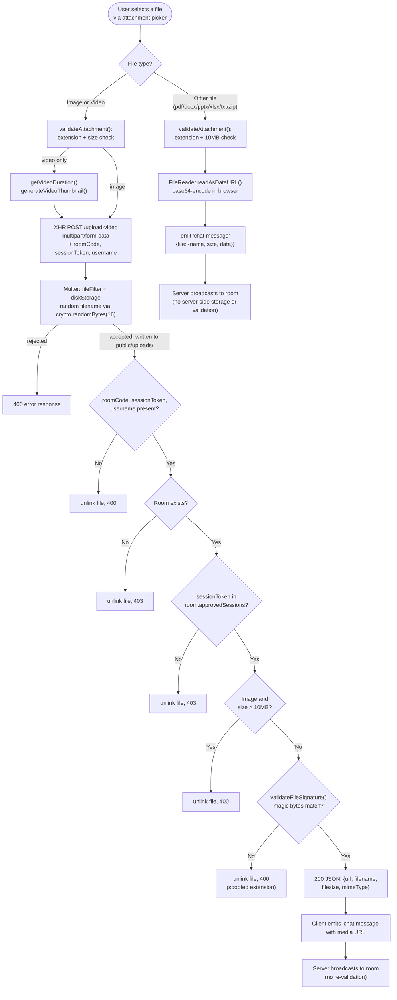
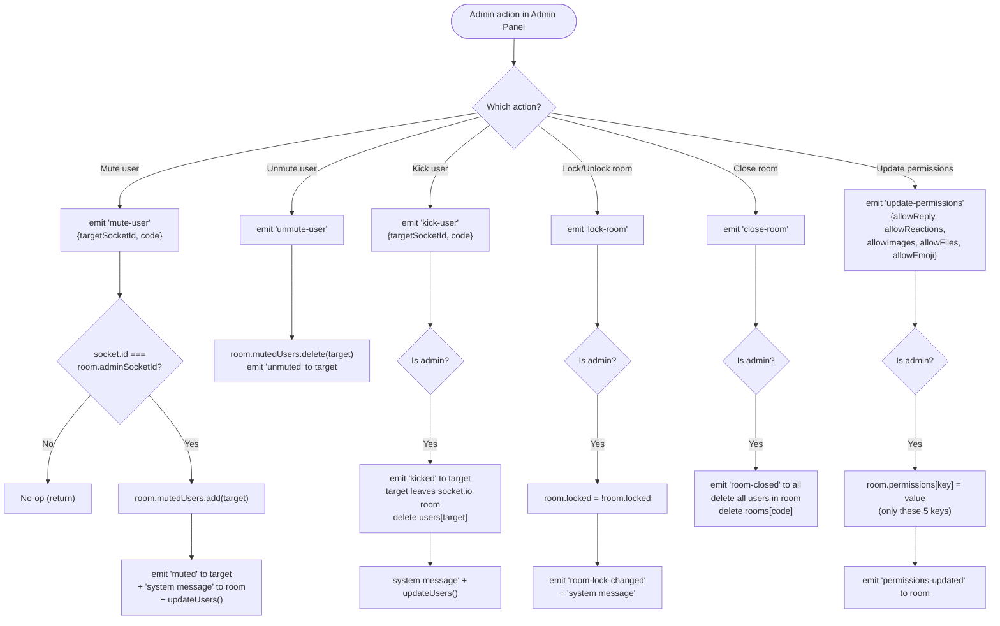
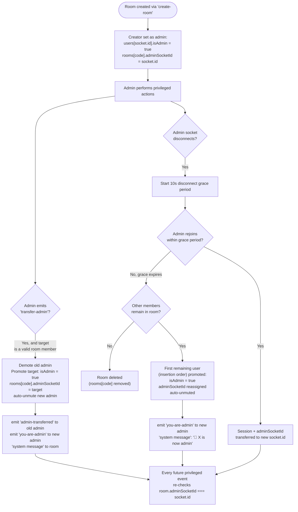

# Chat App — Architecture Documentation

Analysis based on the actual contents of `server.js`, `public/index.html`, `public/script.js`, `public/style.css`, and `package.json`. Nothing below is assumed — every behavior described was traced to a specific code path.

---

## 1. Architecture Overview

This is a **monolithic Node.js application** with two coupled communication channels, no database, and no build step:

- **Backend**: a single file, `server.js`, running Express 5 + `http` + `socket.io` (v4) in one process.
- **Frontend**: a static single-page app (`index.html` + `script.js` + `style.css`) served by `express.static("public")`. There is no framework (no React/Vue) — all DOM manipulation is vanilla JS.
- **State**: entirely **in-memory**. Two module-level objects, `rooms` and `users`, hold all runtime state. There is no database layer — `mongoose` is listed in `package.json` as a dependency but is **never required or used anywhere in `server.js`**. Restarting the server wipes all rooms, users, and messages.
- **Media storage**: uploaded images/videos are written to disk at `public/uploads/` via Multer and served back out through the same static file handler.

Because everything lives in one Node process with in-memory maps, the app is single-instance by design — it has no session store, message queue, or horizontal-scaling mechanism.

---

## 2. Major Modules

| Module | Location | Responsibility |
|---|---|---|
| **HTTP/Static server** | `server.js` (`app`, `express.static`) | Serves the SPA and static assets from `public/` |
| **Upload endpoint** | `server.js` (`POST /upload-video`, Multer config) | Handles binary upload of images/videos with validation |
| **Socket.IO server** | `server.js` (`io.on("connection", …)`) | All real-time events: rooms, chat, moderation, presence |
| **In-memory stores** | `server.js` (`rooms`, `users`, `disconnectTimeouts`) | Runtime state — no persistence |
| **Room lifecycle helpers** | `server.js` (`generateRoomCode`, `updateUsers`, `cleanupUserSession`) | Room code generation, presence broadcast, disconnect/reassignment logic |
| **File signature validator** | `server.js` (`validateFileSignature`) | Magic-byte checking for uploaded media |
| **SPA shell** | `public/index.html` | Landing screen, waiting screen, chat screen, admin panel, modals (sticker crop/preview, image lightbox) |
| **Client controller** | `public/script.js` | Socket client, all UI wiring, upload handling, admin controls, stickers, reactions |
| **Styling** | `public/style.css` | Presentation only, no logic |
| **Upload directory** | `public/uploads/` | Disk target for Multer, served statically |

---

## 3. Frontend ↔ Backend Communication

Communication happens over **two separate channels**, used for different payload types:

1. **Socket.IO (WebSocket, persistent connection)** — used for everything that is event-driven and real-time: joining/creating rooms, chat messages, typing indicators, reactions, presence (`users list`), and all admin/moderation actions. The client wraps `socket.emit` in a `safeEmit()` helper that queues the event and forces `socket.connect()` if the socket is currently disconnected, so UI actions taken while offline aren't silently dropped.
2. **HTTP REST (`POST /upload-video`, multipart/form-data)** — used **only** for images and videos. This is a separate request/response cycle handled by Multer, independent of the Socket.IO connection. On success it returns a JSON body (`{ success, url, filename, filesize, mimeType }`); the client then emits that URL through a normal `chat message` Socket.IO event so it gets broadcast like any other message.

A third, less obvious path exists: **non-image/video file attachments** (`.pdf`, `.docx`, `.pptx`, `.xlsx`, `.txt`, `.zip`) are **not** sent through the `/upload-video` HTTP endpoint at all. They are read client-side with `FileReader.readAsDataURL()`, base64-encoded, and embedded directly inside the `chat message` Socket.IO payload (`data.file.data`). The server does not store these files or run any validation on them beyond relaying the socket event — validation for these exists only client-side (extension allowlist + 10 MB size check in `validateAttachment`).

There is also a `sessionToken` (a random string generated client-side and stored in `sessionStorage`) sent with room-join and upload requests. The server uses it to track `room.approvedSessions`, which allows a user to reconnect/refresh without re-triggering the admin-approval workflow.

---

## 4. Socket.IO Event Flow

**Client → Server events:** `new user`, `create-room`, `join-room-request`, `approve-user`, `reject-user`, `cancel-join-request`, `kick-user`, `lock-room`, `transfer-admin`, `close-room`, `update-permissions`, `add-reaction`, `mute-user`, `unmute-user`, `chat message`, `typing`, `rejoin`, `disconnect` (implicit).

**Server → Client events:** `system message`, `users list`, `room-created`, `waiting-approval`, `pending-request`, `request-cancelled`, `join-approved` / `approved`, `rejected`, `kicked`, `room-lock-changed`, `admin-transferred`, `you-are-admin`, `room-closed`, `permissions-updated`, `reaction-updated`, `reaction-denied`, `muted`, `unmuted`, `you-are-muted`, `chat message`, `typing`, `rejoined-successfully`, `rejoin-failed`.

Key characteristics observed in the code:
- The server never trusts a client's claim of admin status — every privileged handler re-checks `room.adminSocketId === socket.id` before acting.
- `chat message` broadcasts are re-checked server-side against `room.mutedUsers` even though the client also disables the send button when muted (`you-are-muted` is emitted if a muted socket manages to send anyway).
- **Note:** `script.js` registers a listener for a `load messages` event (intended to deliver chat history on join), but `server.js` never emits this event and never pushes into `room.messages`. This means message history is *not* actually replayed on join — `room.messages` is initialized but unused, and this is dead code on the client.

---

## 5. Media Upload Processing

Two distinct pipelines exist, split by file type:

**Images & videos (`/upload-video` HTTP endpoint):**
1. Client-side: `validateAttachment()` checks extension/size (100 MB for video, 10 MB for other files) before upload starts.
2. For video specifically, the client extracts duration (`getVideoDuration`) and generates a thumbnail (`generateVideoThumbnail`, via an off-screen `<video>`/`<canvas>`) *before* uploading.
3. The file is sent via `XMLHttpRequest` as `multipart/form-data` to `POST /upload-video`, with `roomCode`, `sessionToken`, and `username` fields attached, and upload progress is tracked via `xhr.upload.onprogress`.
4. Server-side, Multer's `diskStorage` writes the file to `public/uploads/` under a **cryptographically random filename** (`crypto.randomBytes(16).toString('hex') + ext`), preventing path traversal, collisions, or overwrites. A `fileFilter` restricts extensions/MIME types before the write even happens.
5. After Multer accepts the file, the route handler runs additional checks and deletes the file (`fs.unlinkSync`) if any fail: required params present → target room exists → `sessionToken` is in `room.approvedSessions` → (for images) size ≤ 10 MB → binary **magic-byte signature** matches a known video/image format (`validateFileSignature`, checked against WebM/MKV, AVI, MP4/MOV, PNG, JPEG, WebP headers).
6. On success, the server responds with the file's public URL; the client then emits a normal `chat message` Socket.IO event referencing that URL, which gets broadcast to the room — the file itself is not re-validated at broadcast time.

**Other file types (pdf, docx, pptx, xlsx, txt, zip):**
- These skip the HTTP endpoint entirely. They're base64-encoded in the browser and sent as part of the `chat message` socket payload. No server-side storage, no magic-byte check, no size enforcement beyond the client-side 10 MB gate in `validateAttachment`.

---

## 6. Room Management

- Rooms live in the in-memory `rooms` object, keyed by a **6-character uppercase alphanumeric code** generated by `generateRoomCode()`, which loops until it finds a code not already in use.
- `create-room` initializes: `name`, `code`, `type` (`'public' | 'approval' | 'private'`), `adminSocketId`, `locked`, `messages` (array, unused — see §4), `pendingRequests`, `mutedUsers` (`Set`), `reactions`, `approvedSessions` (`Set`), and a `permissions` object.
- **Room type behavior** — the only branching found in the code is on `room.type === 'public'`: public rooms skip the waiting room and auto-join. Both `'approval'` and `'private'` room types follow the identical pending-request/admin-approval flow — no other distinguishing logic between those two types exists in the code.
- **Approval flow**: for non-public rooms, `join-room-request` adds the requester to `room.pendingRequests` and emits `pending-request` to the admin's socket. The admin's `approve-user`/`reject-user` events resolve it.
- **Reconnection bypass**: once a `sessionToken` is added to `room.approvedSessions` (on join, approval, or room creation), future `join-room-request`/`new user` events with the same token skip the pending queue entirely — including bypassing the room-locked check, since the `approvedSessions` check runs before the `locked` check.
- **Locking**: `lock-room` toggles `room.locked`, which blocks *new* `join-room-request` attempts (not already-approved sessions).
- **Disconnect grace period**: on `disconnect`, the server doesn't clean up immediately — it starts a 10-second timeout (`disconnectTimeouts`). If the client reconnects and emits `rejoin` with a matching username/room/sessionToken before the timeout fires, the session is transferred to the new `socket.id` and the timeout is cancelled.
- **Room teardown**: a room is deleted when its last member's disconnect grace period expires and no one is left (`cleanupUserSession`), or immediately when the admin emits `close-room`.

---

## 7. Admin Permissions

- Admin status is a boolean (`isAdmin`) on the in-memory `users[socket.id]` record, and the source of truth for authorization is `room.adminSocketId`.
- **Every privileged Socket.IO handler independently verifies** `room.adminSocketId === socket.id` before acting — the server never relies on a client-supplied `isAdmin` flag. Handlers gated this way: `approve-user`, `reject-user`, `kick-user`, `mute-user`, `unmute-user`, `lock-room`, `transfer-admin`, `close-room`, `update-permissions`.
- **`transfer-admin`**: demotes the current admin, promotes the target user, updates `room.adminSocketId`, and auto-unmutes the new admin if they were muted.
- **Auto-reassignment on disconnect**: if the admin disconnects and their grace period expires with other members still present, `cleanupUserSession` promotes the first remaining entry in the `users` object (insertion order) to admin, emits `you-are-admin` to them, and broadcasts a system message.
- **`update-permissions`**: only 5 of the 8 keys defined in the room's `permissions` object are actually settable by the admin — `allowedKeys = ['allowReply', 'allowReactions', 'allowImages', 'allowFiles', 'allowEmoji']`. The other three fields defined at room creation (`allowPolls`, `allowScreenShare`, `allowInviteLinks`) are initialized but **never read or toggled anywhere else in the code** — they have no observable effect.
- Enforcement of these permissions server-side is only confirmed for `allowReactions` (checked in the `add-reaction` handler, emitting `reaction-denied` if false). Enforcement of `allowReply`, `allowImages`, `allowFiles`, and `allowEmoji` was **not found** in `server.js` — the client hides UI accordingly, but nothing in the provided server code blocks the underlying `chat message` event if a client bypassed the UI.

---

## 8. Security Mechanisms

Mechanisms actually present in the code:

1. **Server-side admin authorization** — all privileged actions re-check `socket.id` against `room.adminSocketId`; client claims are never trusted.
2. **Server-side mute enforcement** — the `chat message` handler checks `room.mutedUsers` independently of the client-side send-button guard.
3. **Room approval / waiting-room gating** for non-public rooms, with explicit admin accept/reject.
4. **Room locking** to block new join requests.
5. **Session-token-based reconnection tracking** (`approvedSessions`) — note this token is a client-generated random string (`'token_' + Math.random().toString(36)...`), not a cryptographically signed credential; it establishes continuity, not strong identity.
6. **Upload hardening on `/upload-video`**:
   - Randomized filenames (`crypto.randomBytes(16)`) prevent path traversal, overwrite, and collision.
   - Extension + MIME-type allowlist (`fileFilter`).
   - Size limits: 100 MB (Multer global limit), with an additional 10 MB cap enforced specifically for images post-upload.
   - **Magic-byte file-signature validation** (`validateFileSignature`) rejects files whose binary header doesn't match a real video/image format, even if the extension/MIME type was spoofed.
   - Upload requests are rejected (and the file deleted) unless `roomCode` exists and the `sessionToken` is present in that room's `approvedSessions`.
7. **No authentication system** — usernames are freely chosen with no password/account layer; identity for moderation purposes is tied only to `socket.id` and the unsigned session token.
8. **Asymmetric validation gap** — generic file attachments (pdf/docx/pptx/xlsx/txt/zip) bypass all of the server-side upload hardening in point 6 entirely, since they travel as base64 inside a `chat message` socket event rather than through `/upload-video`.
9. **No persistence** — all state is in-memory only; a server restart clears every room, user, and message (this also means there is no audit trail).

---

## Diagrams

### 1. High-Level System Architecture

### 2. Component Diagram

### 3. User Workflow

### 4. Socket.IO Sequence Diagram

### 5. Media Upload Flow

### 6. Room Moderation Flow

### 7. Admin Permission Flow

---

## Notable Observations (not assumptions — directly traceable in code)

- `mongoose` is a declared dependency but is dead weight; the app has no database.
- `room.messages` and the client's `load messages` listener form an **incomplete feature** — history is never persisted or replayed.
- `'approval'` and `'private'` room types are functionally identical in the server logic; only `'public'` is special-cased.
- Three of eight `room.permissions` fields (`allowPolls`, `allowScreenShare`, `allowInviteLinks`) are defined but never read or enforced.
- Generic file attachments (non-image/video) bypass all server-side upload security entirely, unlike images/videos.
